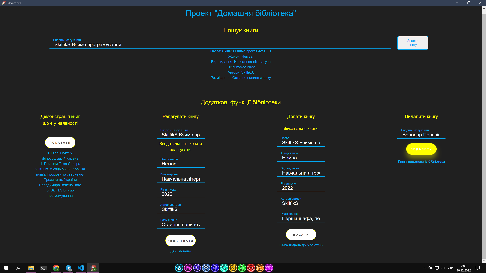

# LibraryProgram-Python-WebDesign

Проект для курсової роботи.

Основні умови:
1. Мова програмування "Python"
2. Будь-який графічний інтерфейс
3. Функція пошуку книг
4. Функції додавання/редагування/видалення книг

Программа виконана стандартними методами Python. Код простий та повністю розкоментований, графічний інтерфейс виконаний за допомогою Web Програмуванння на HTML, CSS, JS. Графічний інтерфейс зв'язаний з Python за допомогою бібліотеки "eel", Функції Python викликаються у программі через JS

Программа:

